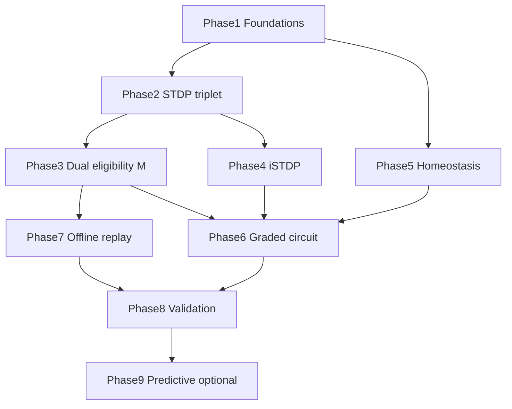

# Biological Learning Roadmap

**Status:** Active implementation outline  
**Date:** 2026-07-16  
**Authority:** `Documents/tenants.txt`, `Documents/model_equations.md`, `checkpoints/CONTINUE-TOMORROW.md`

**Purpose:** Evolve Paradigm from phenomenological conductance learning to **neuron-local, synaptic** rules aligned with neuroscience — while preserving unguided 4-shape emergence and locked production doctrine.

**Alignment docs (2026-07-17):** Foundations, audit matrix, and phased plan live in [`biological_training_foundations.md`](biological_training_foundations.md), [`biological_alignment_audit.md`](biological_alignment_audit.md), and [`biological_alignment_plan.md`](biological_alignment_plan.md). Use those for BP1–BP10 criteria, production-vs-biology verdicts, and P0–P8 sequencing; this roadmap remains the living phase-status board.

---

## Phase status (living)

| Phase | Title | Status | Notes |
|-------|-------|--------|-------|
| **1** | Foundations: truth, metrics, ecological purity | **In progress** | Doc drift reconciled; purity tests + baseline harness added |
| **2** | STDP → triplet excitatory plasticity | **Timing integrated** | `plasticity_mode` + ms-scale pulse timing in nucleus |
| **3** | Dual eligibility + neuromodulatory third factor | **Implemented (lab)** | `dual_eligibility_enabled`; readiness + M(t) gate |
| **4** | Inhibitory biology (iSTDP, NI maturation) | **Implemented (lab)** | `plastic_ni_enabled` + wired `_apply_inhibitory_plasticity` |
| **5** | Homeostatic scaling + set-points | **Implemented (lab)** | `scaling_lab_enabled` + L1/L2 scaling |
| **6** | Circuit de-engineering (graded descending) | **Implemented (lab)** | `descending_mode` force \| graded |
| **7** | Offline replay & consolidation time | **Implemented (lab)** | `offline_replay_enabled`; quiescence decay + replay buffer |
| **8** | Validation vs Abhi + integrity harness | **Implemented** | `@biological` gate, tune_catalog triage, compare_abhi §5 |
| **9** | Predictive coding as local neuromodulation | **Implemented** | `PredictionErrorModulator` facade (recall freeze / PE-LTD / M_error) |

**Implementation policy:** New biology ships behind `lab_profile` / `plasticity_mode` flags. Production locked knobs (`eligibility_alpha=0.45`, exclusivity ON, rematch gain `0.7`) stay until Phase 8 metrics pass on lab profile.

---

## Current state (honest)

Rotation runs already prove **unguided emergence** — four distinct L2 owners via plasticity + eligibility. That is real learning, but much of it uses **phenomenological** rules and **engineered** competition (exclusivity force-fire, saturated L1/L2I).

| Requirement | Biology | Today |
|-------------|---------|--------|
| Learning unit | Synapses from spike timing + neuromodulation | L2 conductance maps + scalar eligibility |
| Timing | STDP / triplet STDP (ms-scale) | Charge-gated aggregate LTP (no Δt) |
| Credit assignment | Silent eligibility + third factor | Single E trace; PE-LTD as error proxy |
| Inhibition | Learned I→E (iSTDP, turnover) | NI channels **frozen/saturated** in production |
| Homeostasis | Slow firing-rate scaling | L1 scaling **disabled** (`scaling_eta=0`) |
| Competition | Emerges from E/I balance | Force NI, membrane wipe, same-tick cascade |
| Oracle | None | **None** for rotation; mastery reads bind state to advance |

---

## Locked doctrine (do not reopen without explicit re-init)

| Item | Value / rule |
|------|----------------|
| Catalog | 4 shapes (`H1`, `V1`, `D0`, `D1`) / 4 ring E only |
| Descending cascade | L2E → E′ → L1I; first authentic L2E → force L2I → wipe → EP-weighted E′ → force L1I |
| Saturated upstream | L1 InputEdge, L1I, L2I NI non-plastic at max in production |
| `bound_match_recall_drive_gain` | **0.7** |
| `eligibility_alpha` | **0.45** |
| `pretrained_inhibitor_exclusivity_enabled` | **ON** (production); soft OFF = lab ecology only |
| Rejected shortcuts | `GridMatcher`, signed OFF depression, `eta_loss`, `l1i_immediate_relay`, global renormalization, API winner injection |

---

## Phase 1 — Foundations: truth, metrics, ecological purity

### Goal
One normative spec and measurable unguided baseline before changing equations.

### Biological target
Learning proceeds without the system knowing which neuron will encode which stimulus — only local activity and input statistics matter.

### Gaps (addressed in this pass)
- Doc drift (`biological_fidelity_spec.md` listed eligibility 0.84, consolidation 0.30; code uses 0.80, 0.25).
- Mastery auto-stim reads bind state — fine for demos, not strict ecology.
- `system_overview.md` stale thresholds (0.79 / 0.20).

### Deliverables
| Item | Path |
|------|------|
| Normative constants | `Documents/model_equations.md` §16 |
| Reconciled fidelity spec | `Documents/biological_fidelity_spec.md` |
| Ecological purity matrix | `Documents/archive/self_paced_learning_plan.md` §11 |
| Import guards (rotation/stochastic) | `tests/test_ecological_purity.py` |
| Baseline harness | `scripts/baseline_ecology_benchmark.py` |

### Acceptance criteria
- Doc constants match `LearningDynamics` exactly.
- Rotation + exclusivity ON: **4/4** injective owners in ≤300 pulses (seeds 0, 7, 42).
- Rotation/stochastic stimulus path: zero `PatternMemorySnapshot` reads.
- Guide-dependence ratio: rotation success ≥ 95% of mastery success.

### Risks
Changing default auto-stim from mastery → rotation affects UI pacing — use flags first.

---

## Phase 2 — Synaptic rules I: timing-aware excitatory plasticity (STDP → triplet)

### Goal
L2E sensory and relay synapses learn from **spike timing**, not only aggregate free-energy.

### Biological target
- Pairwise STDP: pre-before-post → LTP; reverse → LTD (Bi & Poo).
- Triplet STDP: slow + fast post traces stabilize interleaved learning (Pfister & Gerstner 2006).

### Gaps
- `ConductancePlasticityLearner` — no presynaptic/postsynaptic Δt.
- Eligibility increments on edge-set match, not coincidence windows.

### Deliverables
| Item | Path |
|------|------|
| Local plasticity protocol | `learning/local_plasticity_rule.py` |
| Pairwise STDP | `learning/spike_timing_plasticity.py` |
| Triplet traces | `domain/triplet_trace.py` |
| Triplet learner | `learning/triplet_plasticity.py` |
| Factory + mode flag | `learning/plasticity_factory.py`, `plasticity_mode` in `learning_dynamics.py` |
| Unit tests | `tests/test_spike_timing_plasticity.py` |

### Acceptance criteria
- Held single pattern: triplet within **2×** pulse count of conductance baseline.
- Rotation interleaved: **4/4** with exclusivity ON.
- L1 InputEdge weights unchanged (frozen invariant).

### Risks
Triplet + multi-spiker policy may need rate normalization; no LTD from silence alone (tenant 2).

---

## Phase 3 — Synaptic rules II: dual eligibility + neuromodulatory third factor

### Goal
Replace scalar eligibility with neoHebbian three-factor gating.

### Biological target
- Distinct LTP vs LTD eligibility traces (Frémaux et al.).
- Neuromodulator M(t): learning mode vs prediction-error mode.

### Deliverables
- `domain/dual_eligibility_trace.py`
- `learning/neuromodulator_gate.py`
- Consolidator hysteresis via `NeuronReadiness`
- Tests: no bind on pulse 1 (100 seeds)

### Acceptance criteria
- `PATTERN_BOUND` never on first pulse.
- M(t) per-neuron or per-assembly — not global teacher (tenant 3).

---

## Phase 4 — Inhibitory biology: iSTDP, NI maturation, E/I balance

### Goal
Inhibitory synapses **learn** like excitatory ones, within tenant bounds.

### Biological target
- iSTDP: symmetric near-coincidence potentiation plus constant depression at inhibitory presynaptic spikes drives target-rate homeostasis (Vogels et al. 2011).
- PV/central inhibition matures with experience.

### Gaps
- NI→E channels re-saturated every NI fire — turnover dead in production.
- `_apply_inhibitory_plasticity` exists but bypassed when NI frozen.

### Deliverables
- `learning/inhibitory_stdp.py`
- NI init with plastic headroom (lab flag)
- Ablation: plastic NI vs frozen NI

### Acceptance criteria
- Lab (exclusivity OFF, plastic NI): rotation ≥3/4 without membrane wipe.
- Production (exclusivity ON, frozen NI): 4/4 regression unchanged.

---

## Phase 5 — Homeostatic regulation: synaptic scaling + set-points

### Goal
Long-run firing rates stay in band without manual threshold tuning.

### Deliverables
- Re-enable L1 I scaling in lab profile only.
- `learning/sensory_homeostasis.py`
- Complete adaptive thresholds via `NeuronReadiness` + scaling

### Acceptance criteria
- 500-pulse rotation: mean spike rate per neuron ∈ [0.05, 0.35].
- 4/4 maintained with η ≤ 0.001.
- Production keeps η=0 until Phase 8.

---

## Phase 6 — Circuit de-engineering: cortical layer fidelity

### Goal
Match L1 relay / L2–3 competition / feedback anatomy; reduce procedural forcing.

### Deliverables
- `DescendingInhibitionMode`: `force | graded` in `descending_inhibition.py`
- Graded E′ path without force L1I (lab)
- Cortical mapping table in `grid_and_layers_research.md`
- `tests/test_graded_descending_ecology.py`

### Acceptance criteria
- Graded + full biology stack (Phases 2–5): 4/4 in ≤80 pulses rotation.
- Force mode (production): 4/4 unchanged.

---

## Phase 7 — Consolidation & time: offline replay and trace dynamics

### Goal
Separate online plasticity from offline consolidation like sleep/replay.

### Deliverables
- Quiescence-modified decay when no sensory input
- `ReplayStimulusStream` — recent edge sets only (no ownership read)
- API `offline_consolidation_steps` (lab)
- `tests/test_offline_consolidation.py`

### Acceptance criteria
- Rotation + replay vs rotation alone: ≥15% fewer pulses to 4/4 (10 seeds).
- Replay stream does not import `PatternMemorySnapshot`.

---

## Phase 8 — Validation: integrity, benchmarks, Abhi comparison

### Goal
Prove biological upgrades keep tenant superiority with audit-grade evidence.

### Deliverables
- Extend `scripts/compare_abhi_paradigm.py`
- Triage `invariant_violations` in catalog tune
- CI gate: `@biological` marker — 4/4, 0 collisions, integrity 100%

### Acceptance criteria

| Metric | Target |
|--------|--------|
| Rotation 4/4 (exclusivity ON) | Pass |
| vs Abhi interleaved (4 shapes) | ≥ Abhi |
| `OWNERSHIP_COLLISION` | 0 |
| Integrity probe | 100% |
| Probe recall (no `line_id`) | 4/4 |

---

## Phase 9 (optional) — Predictive coding as local neuromodulation

### Goal
Unify tenant 8 (prediction) with Phase 3 M(t).

### Deliverables
- `learning/prediction_error_modulator.py`
- Unify recall freeze + M_error + PE-LTD
- Fix `paradigm_spec.md` STDP wording → triplet/conductance

### Acceptance criteria
- Bound mismatch does not corrupt other patterns' weights.
- Bound match: Δw ≈ 0, drive 0.7.

---

## Execution order

**Critical path:** 1 → 2 → 3 → 4 → 6 → 8.  
**Parallel:** Phase 5 after Phase 1; Phase 7 after Phase 3.

---

## Tenant alignment

| Tenant | Phase(s) |
|--------|----------|
| 1 — Firing causal (1 vs Z) | Already; Phase 6 sharpens WTA |
| 2 — Fire together wire together | Phase 2 STDP/triplet |
| 3 — One pattern per neuron, local only | Phases 3, 8 |
| 4 — E/I weights plastic | Phases 2, 4 |
| 5 — Refractory | Already |
| 6 — 1:1 symbol | Phase 3 consolidation |
| 7 — Continuous learning | Phases 3, 5, 7 |
| 8 — Prediction | Phase 9 |
| 9 — Local connections only | All phases |

---

## Related documents

- `Documents/biological_fidelity_spec.md` — implemented causality chain
- `Documents/model_equations.md` — normative equations + §16 constants
- `Documents/archive/self_paced_learning_plan.md` — unguided definition + purity matrix
- `checkpoints/CONTINUE-TOMORROW.md` — production locks and daily resume

---

## One-line verdict

Unguided shape learning at L2 already works; becoming a **true biological model** means replacing phenomenological gates and procedural competition with **timing-based synaptic laws**, **three-factor eligibility**, **living inhibition**, and **homeostasis** — built around the locked L2E→E′→L1I cascade, not instead of it.
