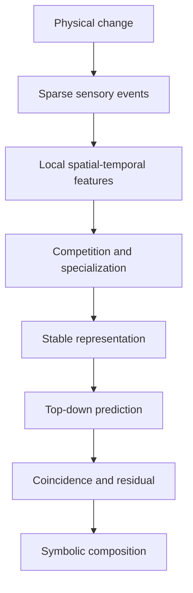

# CIPP/FCSI Project History

**Status:** evidence-based technical retrospective

**Branch reconstructed:** `endofjuly21`

**Archive date:** July 22, 2026

**Primary subject:** the Cortical Information Processing Paradigm (CIPP) and the FCSI simulator built to investigate it

## Why this archive exists

This repository contains much more than one finished simulator. It records an evolving attempt to turn CIPP from lecture diagrams and biological intuitions into a causal, measurable spiking system. During that process, several code lineages, experimental branches, interfaces, agent-generated specifications, and result bundles accumulated. Some mechanisms were demonstrated under narrow protocols; others were implemented but not shown to have the intended physical effect; still others remain proposals.

This archive separates those categories. It is intended to support a CIPP-centered paper, future simulator work, and an honest reconstruction of what was learned.

## Central project question

Can a network of locally learning, event-driven spiking neurons discover recurring sensory structure, develop sparse internal representations, predict the lower-level activity associated with those representations, and preserve unexpected residual activity—without labels, backpropagation, or a global error controller?

The 3×3 four-pattern task is a controlled test of this question, not the final goal. The longer-term CIPP vision is a hierarchy in which local circuits transform physical events into reusable representations and eventually into composable symbols.

## What was built

The repository contains two historically related simulator trees:

1. The **root graph-based simulator** (`backend/`, `snn/`, `frontend/`, `experiments/`). It represents the network as typed nodes and edges and includes `pi`, `old`, `rg`, `rg_residual`, and `rg_coincidence` presets. Its `rg_coincidence` preset adds analytic sub-boundary event ordering and explicit basal/apical coincidence behavior.
2. The **older flexible simulator** under `cipp-learning-AbhiCIPP/`. This line contains the earlier four-pattern dynamics, inhibition and consolidation studies, measurement harnesses, dashboard, and July 14 integration work.

The `notes2/` directory adds lecture transcripts and daily technical syntheses through July 21. It describes later Phase 27–39 investigations, including centered encoding, local prediction, dendritic coincidence, and delayed mismatch/SwitchI work. Not every phase described in those notes is represented by a corresponding commit or production file on this branch. Claims from those notes are therefore labeled **reported** unless a local artifact independently supports them.

## The major scientific lessons

### Representation must emerge causally

A neuron is not assigned the label “horizontal” or “diagonal.” It becomes a representative because it repeatedly participates in the causal response to that input, fires before its competitors, and changes the locally active synapses. Pattern names are observer annotations applied after learning.

### Competition is a timing problem, not merely an inhibition-strength problem

Weak or delayed inhibition permits duplicate winners. Immediate hard reset can eliminate duplicates but can also create first-responder tyranny. A faithful simulator must preserve which neuron physically crosses threshold first while leaving other neurons recruitable for later patterns.

### Overlap makes the four-pattern task meaningful

All four 3×3 patterns cross the center. Hebbian strengthening can overvalue that shared feature and allow one neuron to claim several patterns. Centered/covariance-style encoders reduced the shared-center artifact in later reported experiments but did not by themselves solve four-pattern ownership.

### Stable weights and recoverable weights are not the same

Bounded saturating potentiation can stabilize an owner. Population-wide compression, loser depression, or hard clipping to zero can also remove variation and make unused neurons difficult to recruit. A connection that is mathematically permitted to regrow may be functionally unable to do so if postsynaptic firing is required before learning can occur.

### Prediction must have a physical, selective consequence

A counter, raster row, or learned decoder weight does not prove that prediction works. The relevant test is whether a learned top-down signal changes the membrane, firing, inhibition, or switching of the correct lower-level cells while preserving unexplained novel input.

### Coincidence is architectural

The project moved away from approximating temporal AND with one additive soma. The intended mechanism separates bottom-up basal input from top-down apical input. Neither alone should be sufficient; their local temporal coincidence permits a downstream response. This made the prediction hypothesis clearer and falsifiable.

### Software correctness and scientific support are different

A unit test can show that an event was queued. It cannot, by itself, show that the event changed network behavior or improved CIPP-style ownership. The workflow therefore evolved toward separate structural, execution, instrumentation, experimental, and interpretive checks.

## Current conclusion

The project has implemented and instrumented many of the necessary pieces: event-driven spiking, local plasticity, inhibitory competition, feedback paths, residual/error experiments, explicit coincidence cells, analytic event ordering, configurable topologies, and detailed visualization.

It has **not** completed the whole CIPP pathway. Robust four-pattern ownership across schedules and seeds, selective prediction-driven suppression in the latest intended architecture, mismatch-based switching, long-term stability, repeated cortical columns, scale invariance, what/where binding, and symbolic composition remain open.

That incompleteness is scientifically useful. The simulator has made abstract CIPP claims concrete enough to expose where the architecture works, where numerical implementation changes causality, and where the theory is still underspecified.

## How to read the detailed archive

- [`01_CIPP_VISION_AND_MODEL.md`](docs/project-history/01_CIPP_VISION_AND_MODEL.md) — the computing motivation, complete conceptual pathway, and controlled four-pattern model.
- [`02_IMPLEMENTATION_AND_EXPERIMENT_TIMELINE.md`](docs/project-history/02_IMPLEMENTATION_AND_EXPERIMENT_TIMELINE.md) — chronological reconstruction of code, experiments, and later reported phases.
- [`03_MECHANISMS_FAILURES_AND_LESSONS.md`](docs/project-history/03_MECHANISMS_FAILURES_AND_LESSONS.md) — detailed technical lessons about learning, competition, prediction, coincidence, weights, and measurement.
- [`04_AI_AGENT_WORKFLOW_AND_FOUNDATIONS.md`](docs/project-history/04_AI_AGENT_WORKFLOW_AND_FOUNDATIONS.md) — how agents supported the research and how Pong, DnD, and Pi fit as earlier bounded projects.
- [`05_CURRENT_STATE_AND_OPEN_QUESTIONS.md`](docs/project-history/05_CURRENT_STATE_AND_OPEN_QUESTIONS.md) — demonstrated, partial, reported, rejected, and future components.
- [`06_EVIDENCE_INDEX.md`](docs/project-history/06_EVIDENCE_INDEX.md) — claim-to-file and claim-to-commit map.

## Evidence labels used throughout

| Label | Meaning |
| --- | --- |
| **Implemented** | Directly present in code on `endofjuly21`. |
| **Experimentally observed** | Supported by a saved result artifact or reproducible experiment in this branch. |
| **Reported** | Described in lecture notes, an agent report, or prior project history, but the corresponding code/result is not fully present here. |
| **Interpretation** | A reasoned explanation of evidence, not a direct measurement. |
| **Open hypothesis** | Proposed mechanism or expected outcome not yet demonstrated. |
| **Superseded/rejected** | Tested or previously used, but not accepted as the current solution. |

## Scope warning

The exact checkout documented here begins at uploaded commits `2a3093d`, `5cee7ef`, and `6ec6a29`. Those uploads aggregate prior work and do not preserve every intermediate Phase 27–39 commit in this branch history. Earlier and later branch names, commit identifiers, and numerical verdicts mentioned in `notes2/` remain valuable leads, but they should not be cited as branch-local proof unless their source artifacts are recovered.
