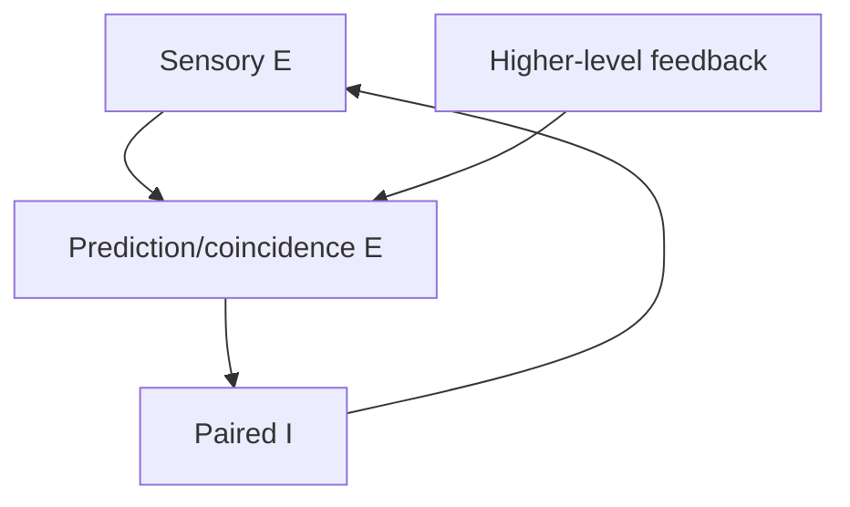

# 1. CIPP Vision and the Controlled FCSI Model

## 1.1 The larger computing problem

Conventional computing normally separates memory from processing. Data is stored, moved to a processor, transformed, and written back. Modern machine-learning systems often amplify this movement by repeatedly operating on large dense arrays. Training and use are usually distinct phases: parameters are optimized first and then deployed for inference.

CIPP investigates a different organization. Its motivating principles are:

- computation occurs where state is stored;
- activity is sparse and event-driven;
- local physical state carries learned information;
- learning and inference coexist in the same network;
- timing and connectivity matter, not only numeric activation values;
- prediction reduces repeated processing of expected structure;
- higher-level representations emerge from recurring sensory causes.

The goal is not to reproduce every biological detail. It is to identify biological organizing principles that could support a different computing paradigm.

## 1.2 From physical events to symbols

The complete conceptual pathway precedes the current implementation:

1. **Physical change creates events.** A sensor should report meaningful change rather than repeatedly transmit a complete dense frame.
2. **Receptor or ganglion-like cells encode events.** These establish the timing and spatial origin of incoming evidence.
3. **Local columns extract spatial-temporal structure.** Repeated configurations such as oriented edges become learnable regularities.
4. **Competition creates sparse specialization.** Different higher-level neurons become responsive to different recurring structures.
5. **A stable representation predicts its causes.** A higher-level neuron sends feedback toward the lower-level features it expects.
6. **Local coincidence distinguishes explained from unexplained input.** Expected feedback affects a column only when corresponding sensory evidence is also present.
7. **Residual activity continues upward.** Features not explained by the current representation remain available to update or switch the interpretation.
8. **Later networks bind normalized structure into symbols.** The edge model is therefore a precursor to, not an instance of, full symbolic reasoning.

## 1.3 The relationship among columns, edges, and symbols

One sloping line in a drawing should not be interpreted as one literal input neuron. It represents a structured pattern distributed across local sensory positions. The current 3×3 model compresses that idea into nine positions so that timing, overlap, competition, and feedback can be measured directly.

Likewise, “one neuron per pattern” is a small-model evaluation criterion, not a claim that the biological cortex always uses a single grandmother cell. A biological analogue could be a sparse assembly. The one-cell criterion provides an observable test: four repeated patterns should not all activate the same unit, and the entire population should not respond identically.

The later symbol-binding network is conceptually distinct. The first network discovers and normalizes local structure; a subsequent network would bind those features into a reusable symbol, potentially separating information about **what** is present from **where** it occurs.

## 1.4 The thalamic or relay role

The project discussions sometimes described the thalamus as sitting between networks. It should not be reduced to a passive cable. In the intended CIPP pathway, a relay/gating stage helps regulate which lower-level activity is forwarded, particularly after a higher-level representation has predicted part of the input. Exactly how that gating maps onto thalamic biology remains an architectural question; the current simulator uses explicit relay, inhibitory, predictor, coincidence, and residual populations rather than claiming a complete thalamic model.

## 1.5 Why a 3×3 four-pattern task

The controlled task uses four three-pixel patterns:

- a horizontal line through the center;
- a vertical line through the center;
- a descending diagonal;
- an ascending diagonal.

All patterns share the center pixel. This makes the task harder and more informative than four disjoint inputs. A successful network must use the full spatial relationship rather than one exclusive feature.

The task asks whether the system can produce:

- distinct pattern representatives without labels;
- stable ownership after switching among patterns;
- continued availability of unused neurons;
- locally justified synaptic changes;
- prediction of the learned lower-level structure;
- selective suppression of explained activity;
- preserved residual response to unexpected structure.

## 1.6 Simplified population roles

The exact populations vary by preset and historical phase, but the intended functional roles are:

| Role | Function |
| --- | --- |
| Sensory/RG source | Emits events corresponding to active spatial positions. |
| L1 excitatory cell | Represents local bottom-up evidence and feeds higher layers. |
| L1 inhibitory cell | Regulates a paired local excitatory pathway. |
| L2 excitatory competitor | Learns a recurring multi-pixel pattern and becomes a candidate representation. |
| L2 inhibitory circuit | Creates competition among L2 candidates. |
| Prediction/coincidence excitatory cell | Combines local sensory evidence with higher-level feedback. |
| Switch or mismatch inhibitory cell | Intended to disrupt an incumbent when unexplained evidence persists. |

The lecture-derived “two E plus one I” local column is:

The first excitatory cell carries current evidence. The second excitatory cell detects the conjunction of evidence and feedback. Its paired inhibitory output marks the explained component locally.

## 1.7 Learning without labels

For an input pattern (x), several L2 neurons accumulate feedforward charge. A neuron becomes the causal winner by reaching threshold before its rivals. Its active afferents then potentiate through a bounded local update of the general form

\[
\Delta w \propto \eta \cdot \text{local activity} \cdot \left(1-\frac{w}{w_{\max}}\right)^2.
\]

The saturating term prevents unlimited growth. The update does not require a class name or a global loss. Repetition makes the winner more responsive to the same spatial structure, producing an emergent receptive field.

This differs from a conventional classifier in two important ways:

1. no output node is preassigned to a class;
2. the scientific target is the network's causal dynamics, not only whether an external readout can decode the answer.

## 1.8 Prediction and residual processing

After specialization, an L2 representative should reconstruct or predict the lower-level features that caused it. For a learned diagonal, feedback should target the three associated columns, not every sensory position.

The intended comparison is local:

| Bottom-up evidence | Top-down prediction | Interpretation |
| --- | --- | --- |
| absent | absent | no event |
| present | absent | unexplained residual |
| present | present | explained coincidence |
| absent | present | false or unsupported prediction; must not be mistaken for a match |

The model therefore requires more than feedback connectivity. It needs a mechanism by which matched evidence changes processing while unmatched evidence remains active.

## 1.9 Basal/apical coincidence

The project ultimately represented coincidence through distinct dendritic roles:

- **basal/proximal input:** current local sensory evidence;
- **apical/distal input:** top-down expectation from an L2 representation.

The physical gate should require both within the defined causal window. A residual trace may support local learning eligibility, but an old trace should not count as a new physical coincidence. This distinction was central to moving away from additive-neuron workarounds that could eventually fire from repeated feedback alone.

## 1.10 What the current model does not yet establish

The controlled task does not prove scale invariance, general vision, symbolic reasoning, biological completeness, or energy efficiency in hardware. It tests whether the first causal ingredients can coexist. Those larger claims require repeated columns, moving and rescaled inputs, hierarchical binding, explicit what/where experiments, and hardware measurements.
