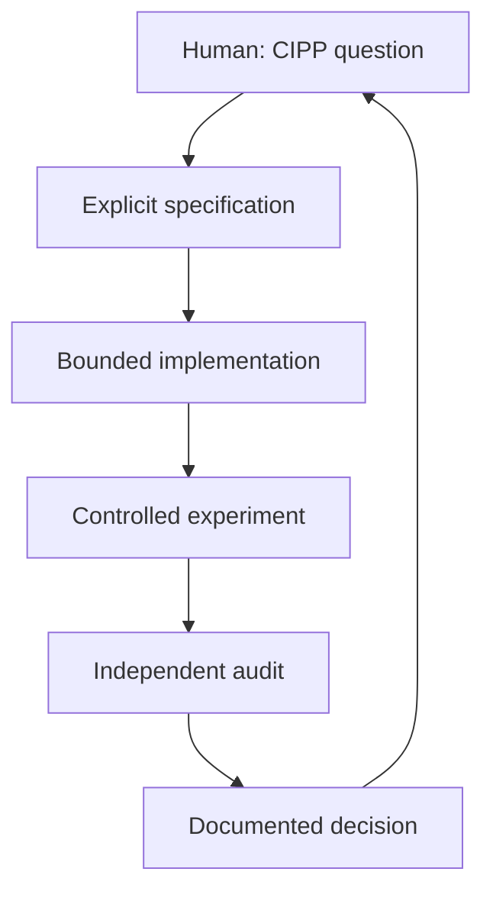

# 4. AI-Agent Workflow and Earlier Foundations

## 4.1 Proper role in the project story

CIPP is the subject; FCSI is the experimental simulator; AI agents are research instruments. The agents accelerated implementation, diagnosis, documentation, and visualization, but they did not define the scientific objective.

The agent story belongs after the reader understands the CIPP architecture because the main difficulty was preserving that architecture while code and experiments multiplied.

## 4.2 Earlier bounded projects

The following material is preserved from prior project reports but is **not backed by source artifacts in this branch**. It should be treated as reported history until the original directories, commits, or benchmark logs are recovered.

### Pong — reported

The Pong work reportedly progressed through:

- a Pygame game with a simple follow-the-ball opponent;
- a WebSocket/browser version that allowed an external agent to interact;
- separation of game logic from rendering/networking;
- a Gymnasium-compatible wrapper;
- a PyTorch DQN trainer with replay and a target network;
- a live player loading a trained `hermes_brain.pth`;
- headless training and a closed-loop Pygame version.

The durable methodological lessons are plausible and consistent with the later FCSI workflow:

- separate the environment from presentation;
- use a standard state/action interface;
- train or test headlessly when possible;
- keep the live loop synchronized with the simulated loop;
- verify trained behavior rather than inferring it from the existence of a weights file.

Claims about millions of frames, “elite” play, or the existence of a final weight file should remain unverified until the artifacts are recovered.

### DnD — reported and incompletely evidenced

Two different old summaries describe DnD differently: one calls it a conceptual state-management exploration; another implies a deterministic rules engine and character-building system. No DnD files or commits are present in `endofjuly21`. The archive therefore records only the cautious common lesson: open-ended rules, changing entities, and long-lived state are harder for an agent to manage than a fixed game loop.

It should not be described in a paper as a completed system without additional evidence.

### Pi/HPC — reported

Prior reports describe a Chudnovsky binary-splitting implementation, profiling on a cluster, and a divide-and-conquer integer-to-string conversion intended to avoid a Python conversion bottleneck. No source or benchmark output is present here. The reported lesson is still relevant: impressive generated code and performance numbers require reproducible commands, environment information, profiling evidence, and retained benchmark logs.

The frequently repeated figure of approximately 67.9 million digits per minute must not be presented as verified by this archive.

## 4.3 Why these projects mattered for FCSI

Pong offered a closed world: state, actions, rules, reward, and success were defined. Pi offered a precise numerical output and measurable runtime. Even a DnD rules engine would have a written ruleset against which behavior could be checked.

FCSI differed because the correct architecture and the definition of success were themselves research questions. An agent could produce valid code that implemented the wrong biological interpretation, or improve a convenient metric while weakening the intended mechanism.

## 4.4 Evolution of the agent workflow

### Stage 1: conversational design

The human researcher used an agent to translate lectures, sketches, and questions into an initial computational story. This was valuable for clarifying terminology and generating candidate mechanisms, but informal descriptions were ambiguous. “Prediction neuron,” “inhibition,” “winner,” and “coincidence” could each map to several different algorithms.

### Stage 2: architect–implementer split

The workflow separated a conversational architecture role from a high-throughput implementation role. Detailed Markdown prompts specified:

- allowed and forbidden changes;
- populations and connections;
- equations;
- causal ordering;
- test gates;
- expected output artifacts.

This improved continuity but created handoff risk. A polished completion report could still mask a routing error, misleading metric, or topology mismatch.

### Stage 3: independent measurement and audit

The workflow added distinct checks:

| Check | Question |
| --- | --- |
| Structural | Are the specified cells, edges, flags, and presets present? |
| Execution | Do events traverse those structures at the intended causal time? |
| Instrumentation | Does the metric measure what its name claims? |
| Scientific | Does the behavior support the proposed CIPP conclusion? |
| Regression | Did the bounded change leave older configurations intact? |

This was crucial when UI counters showed activity without physical delivery, when a metric pooled population events but was labeled as an inter-spike interval, and when a graph edge was accepted structurally but not dispatched by the engine.

### Stage 4: role assignment by strength

Agents were assigned according to the work rather than treated as interchangeable:

- conversational synthesis for unclear scientific ideas;
- bounded implementation from a stable specification;
- measurement-only experiments on isolated branches/worktrees;
- skeptical independent audit;
- interface work separated from neural dynamics;
- durable documentation and Git artifacts for continuity.

## 4.5 Failure modes of agent-assisted research

### Proxy optimization

One agent might maximize distinct winners, another eliminate ties, another improve the dashboard, and another add biological detail. Each local goal can be reasonable while the overall system drifts from the real question: does the network learn and predict through the intended local causal mechanism?

### Mechanism accumulation

Agents can propose and implement variants faster than their consequences can be understood. Leak, adaptive thresholds, loser depression, normalization, fast inhibition, local inhibition, centered encoding, decoder maturity, eligibility traces, and mismatch switching all interact. Without staged ablation, success becomes uninterpretable.

### Confidence ahead of evidence

Agent summaries sometimes promoted “implemented” to “works,” or a one-seed success to a general result. The evidence taxonomy in this archive is a direct response.

### Branch and preset confusion

Different agents worked from different commits and worktrees. The dashboard could open with a baseline preset while the backend contained a final candidate. A user could therefore run the newest code and still observe old behavior.

### Context loss

Long conversations and many phases made it easy to forget why a mechanism existed or whether it had been rejected. Repository specifications, result artifacts, and checkpoint commits became a form of long-term experimental memory.

## 4.6 The mature collaboration loop

The human role is not merely approval. It preserves the scientific meaning of the project, decides which evidence matters, and notices when an optimization has changed the question.

## 4.7 Practical rules learned

- Put durable architecture decisions in versioned files.
- Require every experiment to name its commit, configuration, seed, schedule, and active flags.
- Do not let measurement-only work silently change neural dynamics.
- Keep UI changes separate from model changes.
- Use active-versus-shadow comparisons when testing a physical pathway.
- Preserve failed experiments and rejected mechanisms with a clear verdict.
- Treat agent-generated explanations as hypotheses until checked against code and artifacts.
- Prefer a small number of decisive tests to unlimited parameter sweeps.
- Stop and reconstruct the conceptual architecture when experiments cease to answer a clear question.

## 4.8 Contribution of agent assistance

The agents materially increased the rate at which the project could:

- translate lecture concepts into explicit equations and event rules;
- build and refactor multiple simulator architectures;
- generate dashboards and causal instrumentation;
- run seed sweeps and controlled ablations;
- inspect branches and reproduce failures;
- maintain documentation across a long research history.

Their most important indirect contribution was forcing a clearer distinction among intention, implementation, observation, and claim. That lesson supports the CIPP project; it is not the project's central scientific result.
